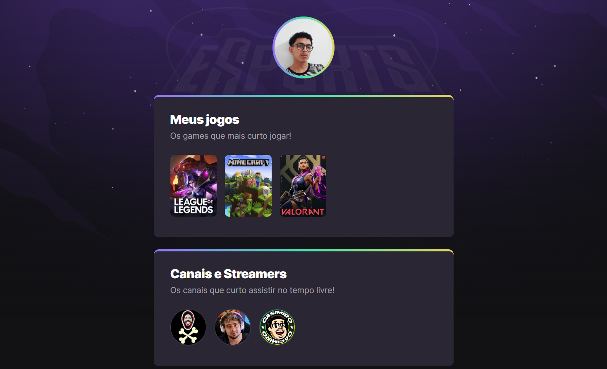

# NLW Esports 🚀

>Trilha Explorer

Projeto com o intuito de aprender a criar e costumizar uma página com a linguagem de marcação ***HTML*** e de estilo, ***CSS***.
O projeto foi construído através das vídeos aulas, futuramente desejo complementar um projeto próprio com todo o conhecimento adquirido deste **incrível evento!**

[🖥️ Clique aqui para acessar!](https://auslic.github.io/NLW-esports-explorer)

## 👤 Contato
guilhermep_alves@hotmail.com